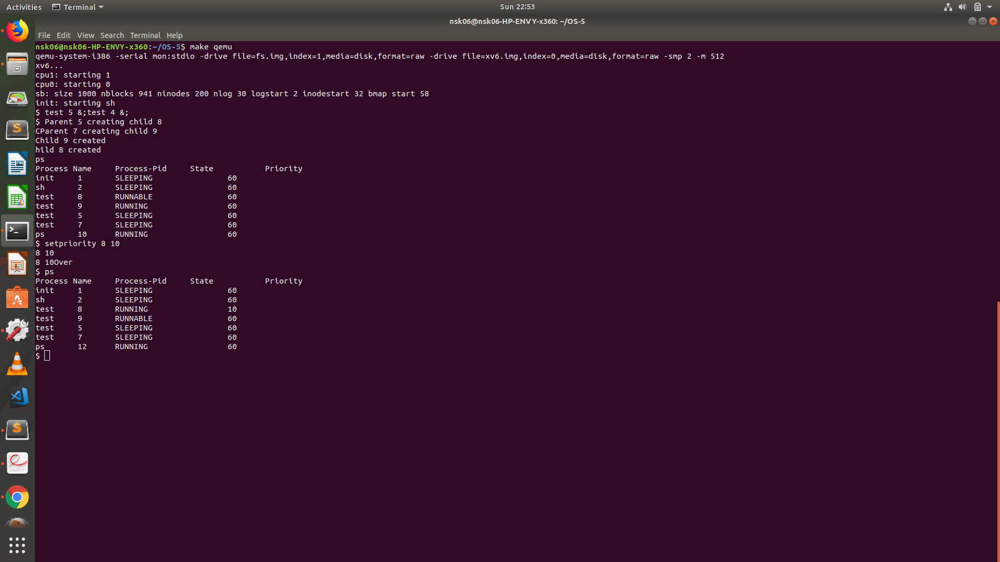

xv6 is a re-implementation of Dennis Ritchie's and Ken Thompson's Unix
Version 6 (v6).  xv6 loosely follows the structure and style of v6,
but is implemented for a modern x86-based multiprocessor using ANSI C.

ACKNOWLEDGMENTS

xv6 is inspired by John Lions's Commentary on UNIX 6th Edition (Peer
to Peer Communications; ISBN: 1-57398-013-7; 1st edition (June 14,
2000)). See also https://pdos.csail.mit.edu/6.828/, which
provides pointers to on-line resources for v6.

xv6 borrows code from the following sources:
    JOS (asm.h, elf.h, mmu.h, bootasm.S, ide.c, console.c, and others)
    Plan 9 (entryother.S, mp.h, mp.c, lapic.c)
    FreeBSD (ioapic.c)
    NetBSD (console.c)

The following people have made contributions: Russ Cox (context switching,
locking), Cliff Frey (MP), Xiao Yu (MP), Nickolai Zeldovich, and Austin
Clements.

We are also grateful for the bug reports and patches contributed by Silas
Boyd-Wickizer, Anton Burtsev, Cody Cutler, Mike CAT, Tej Chajed, eyalz800,
Nelson Elhage, Saar Ettinger, Alice Ferrazzi, Nathaniel Filardo, Peter
Froehlich, Yakir Goaron,Shivam Handa, Bryan Henry, Jim Huang, Alexander
Kapshuk, Anders Kaseorg, kehao95, Wolfgang Keller, Eddie Kohler, Austin
Liew, Imbar Marinescu, Yandong Mao, Matan Shabtay, Hitoshi Mitake, Carmi
Merimovich, Mark Morrissey, mtasm, Joel Nider, Greg Price, Ayan Shafqat,
Eldar Sehayek, Yongming Shen, Cam Tenny, tyfkda, Rafael Ubal, Warren
Toomey, Stephen Tu, Pablo Ventura, Xi Wang, Keiichi Watanabe, Nicolas
Wolovick, wxdao, Grant Wu, Jindong Zhang, Icenowy Zheng, and Zou Chang Wei.

The code in the files that constitute xv6 is
Copyright 2006-2018 Frans Kaashoek, Robert Morris, and Russ Cox.

ERROR REPORTS

Please send errors and suggestions to Frans Kaashoek and Robert Morris
(kaashoek,rtm@mit.edu). The main purpose of xv6 is as a teaching
operating system for MIT's 6.828, so we are more interested in
simplifications and clarifications than new features.

BUILDING AND RUNNING XV6

To build xv6 on an x86 ELF machine (like Linux or FreeBSD), run
"make". On non-x86 or non-ELF machines (like OS X, even on x86), you
will need to install a cross-compiler gcc suite capable of producing
x86 ELF binaries (see https://pdos.csail.mit.edu/6.828/).
Then run "make TOOLPREFIX=i386-jos-elf-". Now install the QEMU PC
simulator and run "make qemu".

Additional:
#### Roll Number - 20171203
#### OS Assignment 5

* Priority Based Scheduler - Priority scheduling involves priority assignment to every process, and processes with higher priorities are carried out first, whereas tasks with equal priorities are carried out on round robin basis.

* Made testbench named as test.c. To test run two separate instances of test in background. e.g test 5 &;test 4 &;

#### Comparison between Round Robin and Priority based scheduler on the basis of starvation

* Round robin allocates time slices to each process in a cyclic manner and stops starvation.
* Priority based scheduling may cause starvation because **high priority** (low number) processes will
  given be given preference over **low priority** (high number) processes.
* With same priority proesses, Round robin scheduler is used.

#### Round Robin

#### Priority Based

