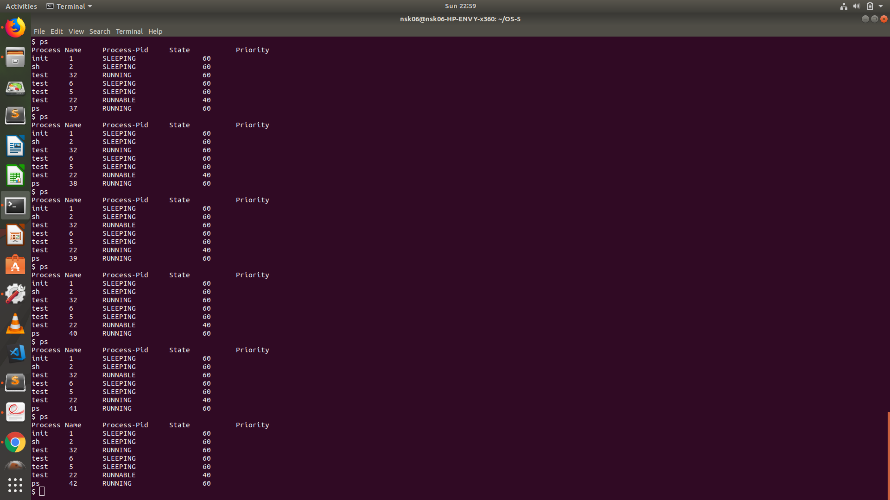
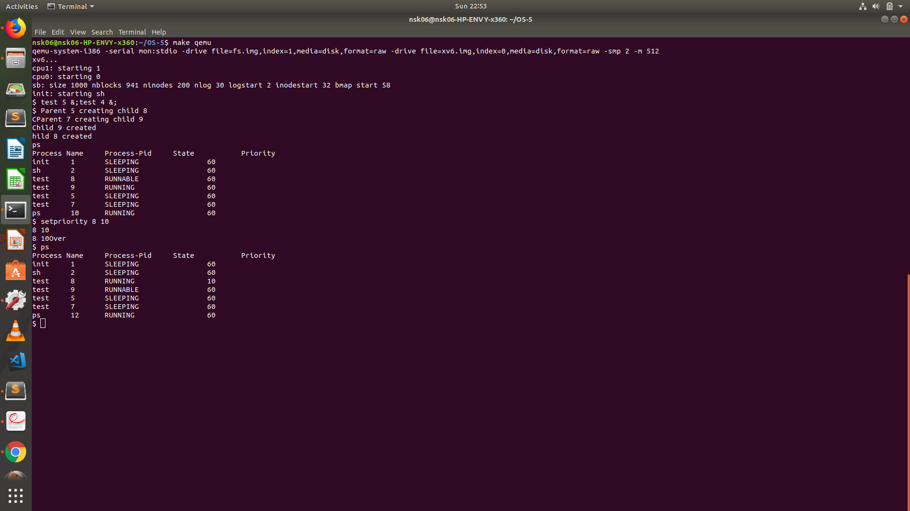

#### Roll Number - 20171203
#### OS Assignment 5

* Priority Based Scheduler - Priority scheduling involves priority assignment to every process, and processes with higher priorities are carried out first, whereas tasks with equal priorities are carried out on round robin basis.

* Made testbench named as test.c. To test run two separate instances of test in background. e.g test 5 &;test 4 &;

#### Comparison between Round Robin and Priority based scheduler on the basis of starvation

* Round robin allocates time slices to each process in a cyclic manner and stops starvation.
* Priority based scheduling may cause starvation because **high priority** (low number) processes will
  given be given preference over **low priority** (high number) processes.
* With same priority proesses, Round robin scheduler is used.

#### Round Robin

#### Priority Based

